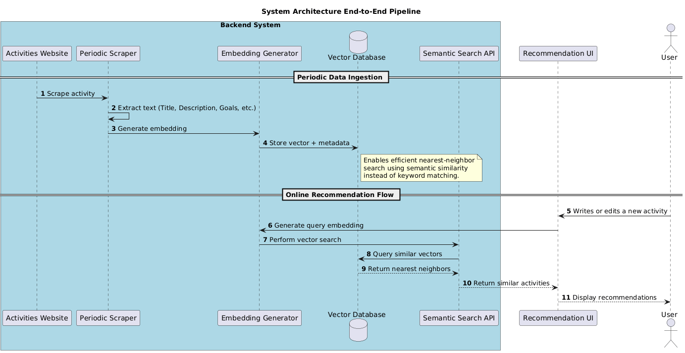
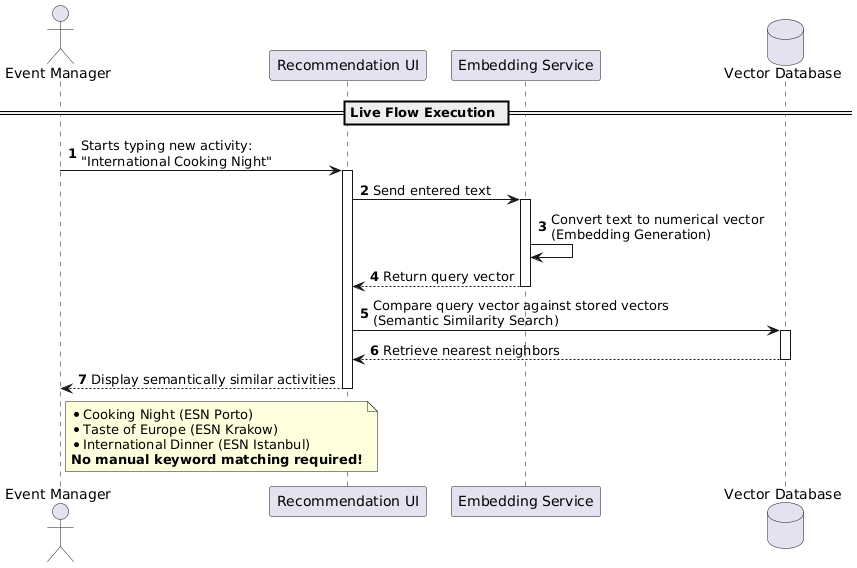
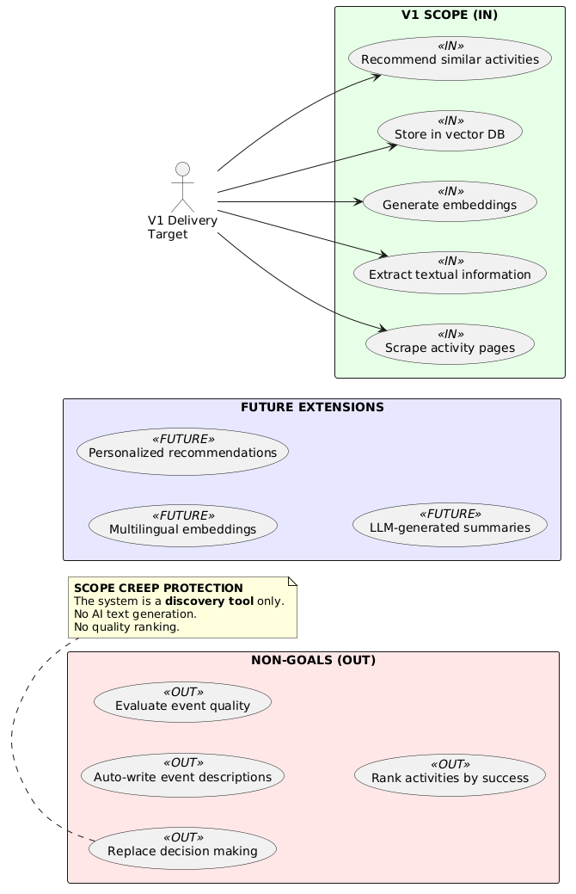

# ESN PULSE

**ESN PULSE** transforms the ESN Activities archive into a semantic discovery and decision support tool for R&D committees and event managers turning a passive record of past events into an active idea engine.

---

## How it works

### System architecture

### Recommendation flow

### Scope — Version 1 vs. future

---

## Core idea

- **Inspire → Adapt → Execute.** ESN sections discover what has worked across the network, adapt it to their local context and run better events.
- **No manual tagging.** Semantic embeddings are generated directly from activity content no extra work for organizers.
- **Discovery first.** The system surfaces relevant activities before a user knows what to search for.

---

## Roadmap

**Version 1: Semantic discovery**
- Activity scraper (ESN Activities platform)
- Embedding generation
- Vector database and similarity search
- Recommendation API

**Near term**
- Section profile recommendations weighted by a section's past activity history
- Recency weighting recent activities ranked higher
- Multilingual embeddings

**Future**
- Pointwise reranking
- Clustering and duplicate detection
- NQ / SQ report integration (National Questionnaire, State of the Network)
- Direct integration with activities.esn.org

---

## Dictionary

- **Activity**: an event or initiative submitted to the ESN Activities platform by a local section.
- **Section**: a local ESN section the primary user of ESN PULSE.
- **R&D Committee**: the research and development working group within a section responsible for event innovation.
- **Embedding**: a numerical vector representation of an activitys textual content, used for semantic similarity search.
- **Vector database**: a database that stores embeddings and enables efficient nearest-neighbor search.
- **Cause**: one of ESN's six thematic areas that activities are organized around (e.g. Education and Youth, Environmental Sustainability).
- **Recommendation**: a ranked list of semantically similar past activities returned in response to a user's input.
- **Inspire -> Adapt -> Execute**: the intended workflow discover a relevant activity from another section, adapt it to the local context and run it.

---

**[ESN PULSE](https://github.com/ESNTurkiye/esn-pulse)** was created in 2026 by the ESN Türkiye webteam for [Erasmus Student Network](https://esn.org) the latter is free to use it, develop it and maintain it at free will, forever.
